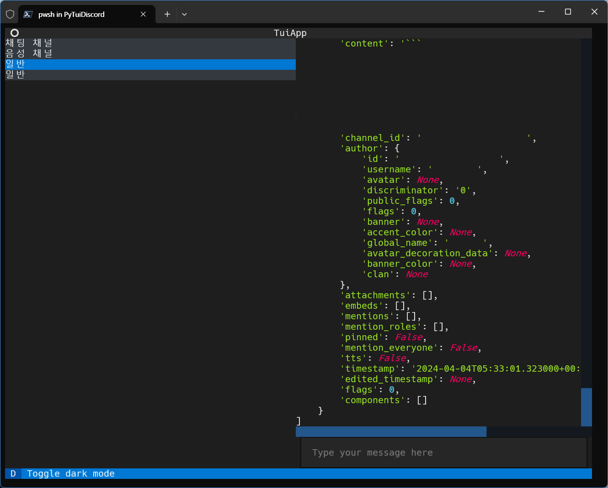

# PyTuiDiscord

PyTuiDiscord is a Python Project that allows you to use Discord in a Terminal User Interface (TUI).
This is still a work in progress and is not yet ready for use.

This project is based on [Textual](https://textual.textualize.io/), a Python library for creating TUIs.



## Installation

```bash
pip install -r requirements.txt
```

## Usage

```bash
python PyTuiDiscord.py
```

## License
[MIT](https://choosealicense.com/licenses/mit/)